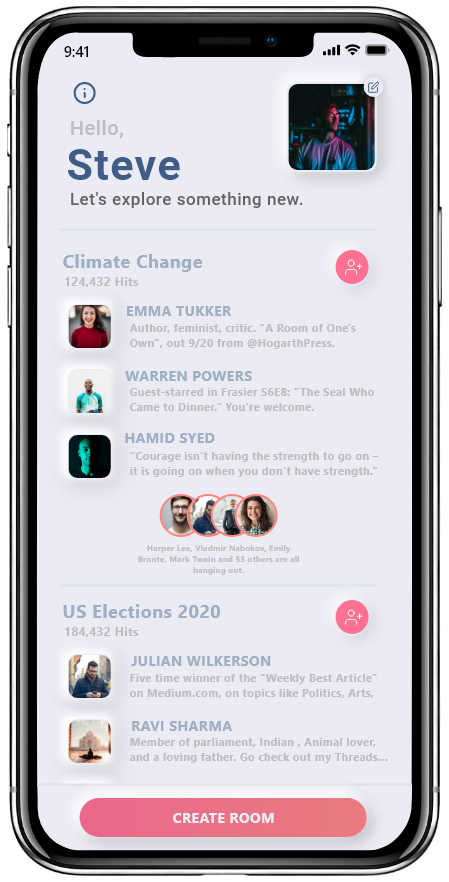
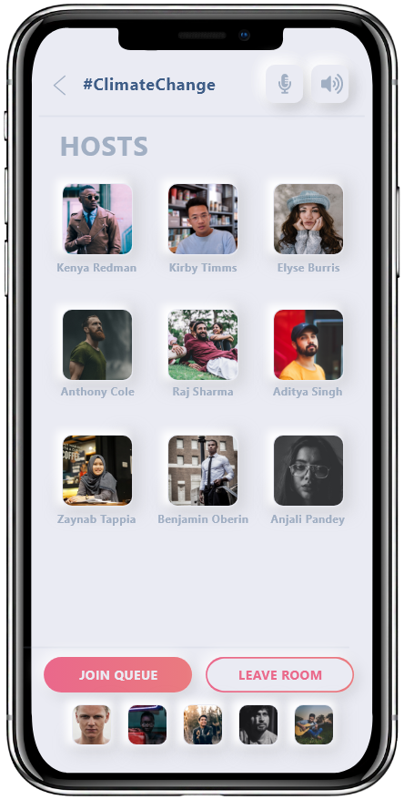

# Keplr
Keplr is an Audio rooms cross native app built with React Native. 

Provided much needed respite for times in distress and protest near us when it was used by people to discuss ideas and get together
-- an early step for greet online and meet offline experience.

## Features

1. Login or signup
2. Create or explore audiorooms based on varied interests.
3. Invite your friends to the room.
4. Join a room to hangout with similar likeminded people.

## Created By: 

[Hasir Mushtaq](https://github.com/ragnar48h)

[Aryaman Shrey](https://github.com/arya-man)

[Aditya Kumar](https://github.com/adityaddy)

## App Screenshots

1. The Login Screen         
2. The Home Screen          
3. The Room

<p float="left" >
  
   
   
</p>

## Download Links

Check out https://play.google.com/store/apps/details?id=com.keplr or https://apps.apple.com/in/app/keplr/id1543771904 for the PlayStore and AppStore versions respectively.

Feel free to use the clone the repo or create a pull request.

## Steps to run the code 
Run the following commands:

```javascript
npm install 
```
```javascript
react-native run-android 
```
```javascript
react-native start